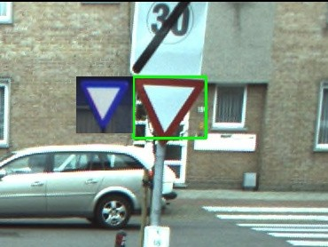

## Project - Traffic Sign Recognition
This project is an implementation of Traffic Sign Recognition

<em>Traffic Sign Tecognition</em>

## Dataset
The Project performs the Sign Recognition for the dataset available at:
https://drive.google.com/drive/u/0/folders/0B8DbLKogb5ktTW5UeWd1ZUxibDA

## Project dependencies
* Python 3.7
* opencv 3.4.2 
* Oxford Dataset

## Executing the project
From the src directory run the following commands

`src/python3 detection.py`
`src/python3 recognize.py `

## Results

Documented report is available at `docs/ENPM_673_project_6.pdf`

<em>Sign Recognition Results</em>

## Refrences
References and supplimentary documentation is provided in `docs/`
